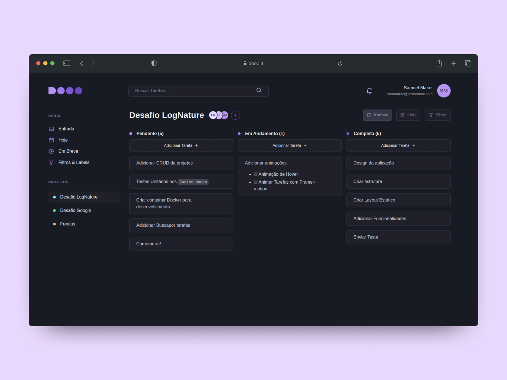

# DOOO
Bom, assim que li a descrição sobre desafio, de desenvolver uma aplicação de gerenciamento de tarefas (to-do list) com 
suporte a status (pendente, em andamento ou concluída), me veio a cabeça uma aplicação estilo Kanban. E assim, resolvi 
criar essa aplicação nesse estilo. Claro, muita coisa aqui está estática ainda, mas o core da aplicação está funcional.



## Como usar

1. Clone o repositório e entre na pasta:
```bash
$ git clone https://github.com/sammarxz/teste-frontend-pleno-lognature && cd teste-frontend-pleno-lognature
```

2. Instale as depêndencias:
```bash
$ yarn
```

3. Execute o servidor de desenvolvimento:
```bash
$ yarn dev
```

4. Abra a URL no navegador: http://localhost:5173/teste-frontend-pleno-lognature

## Comandos Disponíveis

- **dev:** Executa o servidor de desenvolvimento 
- **build:** Executa o build da aplicação gerando a pasta `./dist`
- **test**: testa a aplicação 
- **test:watch**: testa a aplicação e observa por mudanças nos arquivos de teste
- **test:coverage**: testa a aplicação e gera um `coverage report`
- **lint**: Executa o eslint na aplicação e verifica se há erros 
- **prettier**: Executa o prettier na aplicação e verifica e corrige erros de formatação

## Tecnologias Escolhidas
- React + Typescript
- React-Testing-Library + Jest Dom + Vitest
- Eslint + Prettier
- Husky + Lint-staged + Git-commit-msg-linter
- Github Actions + GH Pages
- Chakra-UI
- React-dnd
- LocalStorage
- react-markdown

## Decisões de arquitetura
Continuo tentando achar a arquitetura perfeita, já passei pela Clean Architecture, é interessante, mas 
achei demais, abstração demais. Acho que uma boa arquitetura tem que contar uma história, tem que 
ser simples ao ponto de que um desenvolvedor novato na equipe entre e só de bater o olho entenda como tudo está organizado.

Decidi agrupar os componentes em `módulos`, que representam uma unidade lógica da aplicação podendo ser até um `Domain`
do DDD. Acho essa arquitetura muito interessante, pois digamos que você é um novo membro na equipe e
recebeu uma terefa de corrigir alguns bugs dentro do `Dashboard`, ao invés de você sair procurando arquivos
espalhados pela aplicação que fazem parte desse Dashboard, você verá um módulo com esse nome e tudo que 
diz respeito a ele estará lá dentro, facilitando assim sua tarefa. Essa foi a regra: `Matenha as coisas perto de onde elas são usadas.`

Aqui está um exemplo da estrutura padrão de um módulo:

```
├── modules
|   ├── dashboard
|   |   ├── components
|   |   ├── utils
|   |   ├── hooks
|   |   ├── data
|   |   ├── types
|   |   ├── Dashboard.tsx
|   |   ├── index.ts
```

- `components` irá conter os componentes relacionados aquele módulo
- `utils` irá conter funções pequenas, reusáveis e genéricas. 
- `hooks` irá conter os Custom Hooks
- `types` irá conter algumas tipagens que irão ajudar o desenvolvimento com typescript;
- `data` nesse caso irá conter alguns dados estáticos que vão ser utilizados para construir a aplicação, como uma lista com items do menu, etc.
- `Dashboard.ts` o nome vai mudar dependendo do módulo que esteja inserido, mas esse arquivo será a junção de tudo.
- `index.ts` será o ponto de saída do módulo.

## RoadMap

### Estrutura da aplicação
- [x] Criar repositório
- [x] Configurar Padronização de código (Eslint + Prettier)
- [x] Configurar Testes
- [x] Configurar CI/CD pipeline
- [x] Adicionar verificação pre-commit
- [ ] Configurar Docker

### Desenvolvimento Estático
- [x] Setup do ChakraUI
- [x] Criar dashboard 
- [x] Criar kanban 
- [x] Criar Task

### Desenvolvimento de Funcionalidades
- [x] CRUD de Tasks
- [x] Renderizar Markdown 
- [x] Drag'n Drop